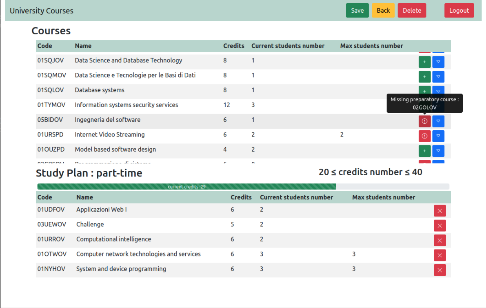

# Exam #1: "StudyPlan"

## Student: s294999 MEZZELA VINCENZO

## React Client Application Routes

- Route `/`
  - if logged in : personal home page with the list of all the university courses and the studyplan (if any). Here the student can create/edit/delete the studyplan.
  - not logged in : home page with the list of all the university courses.
- Route `/login`: Here the user can login.
- Route `/*`: Default route.

## API Server

- GET `/api/courses`

  - Get the list of all the university courses .
  - **Response body** contains the list of all the courses :

    ```
    [
      {
        code: "02GOLOV",
        name: "Architetture dei sistemi di elaborazione",
        credits: 12,
        preparatoryCourse: null,
        maxStudentsNumber: null,
        incompatibleCourses: ["02LSEOV"],
        currentStudentsNumber: 1,
      },
      ...
    ];

    ```

- GET `/api/studyplans`
  - Get the studyplan of the logged-in student.
  - **Response body** contains information about the studyplan of the logged-in student :
    ```
    {
      option: "part-time",
      courses: ["01UDFOV", "03UEWOV", "01URROV", "01OTWOV", "01NYHOV"],
    }
    ```
- POST `/api/studyplans`
  - Save the studyplan for the logged-in student.
  - **Request body** contains information about the new studyplan :
    ```
    {
      option: "part-time",
      courses: ["01UDFOV", "03UEWOV", "01URROV", "01OTWOV", "01NYHOV"],
    }
    ```
- DELETE `/api/studyplans`
  - Delete the studyplan of the logged-in student.
- GET `/api/sessions/current`
  - Get the information about the logged-in student.
  - **Response body** contains :
    ```
    { id: 1, username: "test1@uni.edu" }
    ```
- POST `/api/sessions`
  - Student log in.
  - **Request body** contains login information:
    ```
    { username: "test1@uni.edu", password: "password" }
    ```
  - **Resonse body** contains user information:
    ```
    { id: 1, username: "test1@uni.edu" }
    ```
- DELETE `/api/sessions/current`
  - Student log out.

## Database Tables

### COURSES

This table stores the informations about all the courses.

**`code`**, **name**, **credits**, **_preparatoryCourse_**, **_maxStudentsNumber_**

### STUDENTS

This table stores the informations about all the students and their studyplan option.

**`id`**, **username**, **salt**, **hash**, **_studyplan_**

### STUDYPLANS

This table stores the all the courses codes of each student studyplan.

**`studentID`**, **`courseID`**

### INCOMPATIBLECOURSES

This table stores the pairs of incompatible courses.

**`code_1`**, **`code_2`**

##### Legend

**`primary key`**, **not null fields**, **_optional fields_**

## Main React Components

- `LogInForm` (in [LoginFormCompontents.js](./client/src/Components/LoginFormComponents.js)) : It is a simple form to handle the login.
- `NavbarComponent` (in [NavbarComponents.js](./client/src/Components/NavbarComponents.js)) : It is a simple Navbar. it display the App name on the left, which is also clickable, and some other buttons (`Login`, `Logout`, `Create Study Plan`, ...) depending on the props passed to the component.
- `CourseTable` (in [TableComponents.js](./client/src/Components/TableCompontens.js)) : It is a course table, used both for the full courses list and for the studyplan. Its rendering depends on the props it receives, as this component is used for different purpose. It can expand a row to show other course info, also there can be different button to properly handle the editing of the studyplan, and finally course that cannot be added to/removed from the studyplan are marked differently, and the reason is shown passing the mouse over the exclamation mark.
- `DefaultRoute` (in [ViewRoutes.js](./client/src/Components/ViewRoutes.js)) : It is the Component for the default page.
- `HomeRoute` (in [ViewRoutes.js](./client/src/Components/ViewRoutes.js)) : It is the Component for the not logged-in home page with the list of all the university courses.
- `PersonalHome` (in [PersonalHomeComponents.js](./client/src/Components/PersonalHomeComponents.js)) : It is the component for logged-in home page. Here it is  shown the list of all the university courses and the studyplan (if any). It also handle the studyplan with `saveStudyplan`,`createStudyplan`,`deleteStudyplan`,`getStudyplan`.

## Screenshot



## Users Credentials

| Username      | Password | Studyplan |
| ------------- | -------- | --------- |
| test1@uni.edu | password | part-time |
| test2@uni.edu | password | full-time |
| test3@uni.edu | password | full-time |
| test4@uni.edu | password | part-time |
| test5@uni.edu | password |           |
